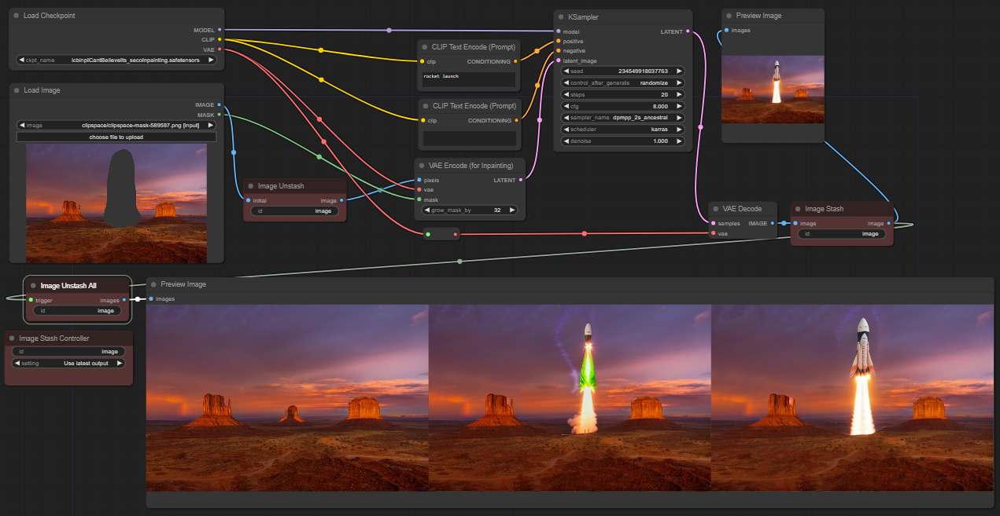

# CG's custom nodes: Stash

[Index of my custom nodes](https://github.com/chrisgoringe/cg-nodes-index)

## Stash

To install:
```
cd [path to ComfyUI]/custom_nodes
git clone https://github.com/chrisgoringe/cg-stash.git
```

Stash is a set of four custom nodes (three required, one optional) designed to make iterative workflows (such as inpainting, img2img, or outpainting) much more convenient. It allows you to 'stash' an image when it is generated, and then choose whether to use it for the next interation, reject it and use the previous image, or start again from your initial image.

Here's an example - inpainting a photo by [Stephen Leonardi](https://unsplash.com/@stephenleo1982) to add a space launch. At the bottom of this page is the image generated, which contains the workflow.



The top half of the workflow is just a typical inpaint setup, except that the `Image Stash` and `Image Unstash` nodes are inserted. `Image Stash` is placed to 'intercept' the output image; `Image Unstash` is placed near the input image, to (potentially) replace it. The stash contains (up to) three different images: `initial` (the image it gets from its initial input), and the `input` and `output` of the last run.

The third essential node is the `Image Stash Controller`. It determines the behaviour of the `Image Unstash` node that share its `id`. It has three settings:

- `New image` - used when you load up a new image. In this setting the `Image Unstash` node passes the `initial` image through untouched (and saves it as `input`).
- `Use latest output` - used when the last iteration was an improvement. In this setting the `Image Unstash` ignores `initial`, and instead returns the `output` from the previous run.
- `Reject latest output` - when an iteration went badly, and you want to go back to the previous one. The `Image Unstash` returns previous `input` again.

In each case, the `Image Stash` node just saves what it gets as `output` and returns it.

The optional node, `Image Unstash All`, returns all three images - from left to right it shows the `initial`, `input`, and `output`. This node has an optional input called `trigger` which you need<sup>1</sup> to attach downstream of the `Image Stash` node in order to ensure that it is executed after the image has been generated.

Here's an image with the workflow:


<sup>1</sup> *Technical note: ComfyUI chooses the output node that is dependant on fewest unexecuted other nodes to run, so the `Image Stash Controller` gets run early, but this means the `Image Unstash All` node will run before the images get generated if it doesn't have an input. [ComfyUI pull request #1348](https://github.com/comfyanonymous/ComfyUI/pull/1348) is a mechanism to allow nodes to be given an explicit priority, so if it gets merged the `trigger` will no longer be needed.*